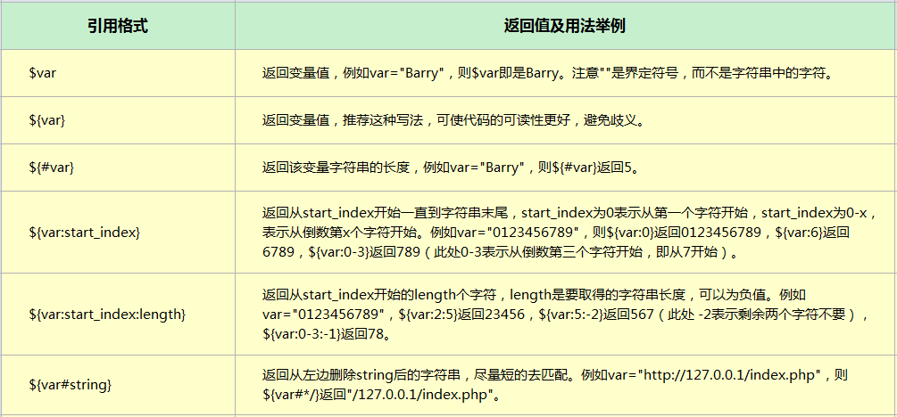
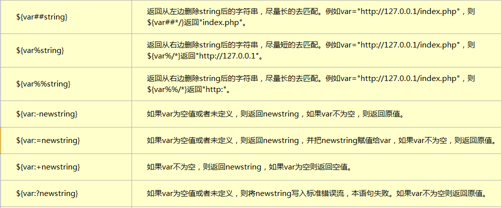
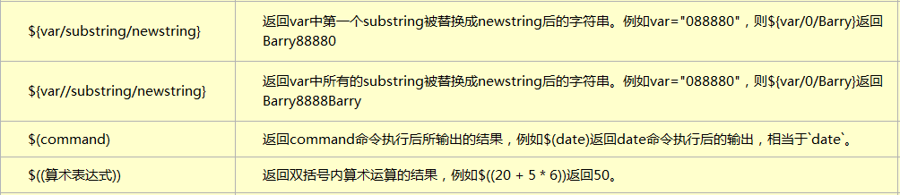

#
shell变量

===================================

##引言

***

&emsp;&emsp;一般在接触一门新的语言时，都要学习他的基本规则，包括基本的语法和运行机制等。本章节只接受基本的语法中的变量的定义和使用，本模块内容使用linux shell做示例

##shell变量的命名规则

***

&emsp;&emsp;变量名必须以字母或下划线字符开头，名字是大小写敏感度的

##shell变量的赋值

***

&emsp;&emsp;变量赋值，等号周围不能有任何空白符。set命令可以查看所有变量，unset清楚变量

##shell变量的引用

***

##shell变量的分类

***

http://www.cnblogs.com/softwaretesting/archive/2012/02/08/2342719.html

http://www.cnblogs.com/barrychiao/archive/2012/10/22/2733210.html

&emsp;&emsp;shell变量可以分为两类：局部变量和环境变量。局部变量只在创建他们的shell中使用；环境变量则可以在创建他们的shell及派生出来的任意子进程中使用

有些变量是用户创建的

###局部变量

***

###环境变量

***

####默认的环境变量

      

####自定义环境变量

&emsp;&emsp;shell

####环境变量配置文件

&emsp;&emsp;linux的环境变量包括用户级和系统级，
系统级的环境变量是每个登录到系统的用户都要读取的系统变量，而用户级是该用户使用系统时加载的
环境变量。所以管理环境变量的文件也分为系统级和用户级。

&emsp;&emsp;用户登录系统后就启动一个shell，linux默认是bash，可以切换至其他shell。
对于bash这个Shell程序来说，可以通过变量名来访问相应的环境变量，通过export来设置环境变量。下面通过几个实例来说明。

- **系统级**

（1）/etc/profile

此文件可以为每个用户设置环境信息，当用户第一次登录时，该文件被执行。并从/etc/profile.d目录的排至文件中搜集shell的设置

（2）/etc/bashrc

为每一个运行的bash shell的用户执行此文件。当bash shell被打开时，该文件被读取。

- **用户级**

下边的文件都处于用户家目录下

（1）~/.bash_profile

每个用户都可舒勇该文件输入专用于自己使用的shell信息,当用户登录时,该文件仅仅执行一次!默认情况下,他设置一些环境变量,执行用户的.bashrc文件.
注：~在LINUX下面是代表HOME这个变量的。

另外在不同的LINUX操作系统下，这个文件可能是不同的，可能是~/.bash_profile； ~/.bash_login或 ~/.profile其中的一种或几种，如果存在几种的话，那么执行的顺序便是：~/.bash_profile、 ~/.bash_login、 ~/.profile。比如我用的是Ubuntu，我的用户文件夹下默认的就只有~/.profile文件。

（2）~/.bashrc

该文件包含专用于你的bash shell的bash信息,当登录时以及每次打开新的shell时,该文件被读取.
(注：这个文件是 .开头的，所以在文件夹中被隐藏了)

（3）~/.bash_logout

当每次退出系统(退出bash shell)时,执行该文件.
另外,/etc/profile中设定的变量(全局)的可以作用于任何用户,而~/.bashrc等中设定的变量(局部)只能继承/etc/profile中的变量,他们是/"父子/"关系.

~/.bash_profile 是交互式、login 方式进入 bash 运行的
~/.bashrc 是交互式 non-login 方式进入 bash 运行的
通常二者设置大致相同，所以通常前者会调用后者。

- **总结**

当你登录并且登录shell是bash时,bash首先执行/etc/profile文件中的命令(如果该文件存在),然后它顺序寻找~ /.bash_profile,~/.bash_login或~/.profile文件,并执行找到的第一个可读文件中的命令.当登录bash退出时,它 将执行~/.bash_logout文件中的命令.
当启动一个交互的bash时,它将执行~/.bashrc文件中的命令(如果该文件存在并且可读).当非交互地启动以运行一个shell脚本时,bash将查找bash_env环境变量,确定执行文件的名称.

####环境变量设置

http://www.blogjava.net/jasmine214--love/archive/2010/11/25/339006.html

###特殊变量

***

$0：当前脚本的文件名

$num：num为从1开始的数字，$1是第一个参数，$2是第二个参数，${10}是第十个参数。注意：

$#：传入脚本的参数的个数

$*：所有的位置参数(作为单个字符串) 

$@：所有的位置参数(每个都作为独立的字符串)。

$?：当前shell进程中，上一个命令的返回值，如果上一个命令成功执行则$?的值为0，否则为其他非零值，常用做if语句条件

$$：当前shell进程的pid

$!：后台运行的最后一个进程的pid

$-：显示shell使用的当前选项

$_：之前命令的最后一个参数
